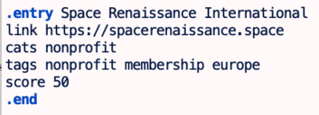

<!-- README.md was generated from README.lt3 -->

<h1>links_manager</h1>

Eventual purpose: Manage a curated set of web links.
Later this will be a Rails app.

<h2>Concept</h2>

The basics are:

<ul>
<li>Links are divided into fairly broad categories. Each may have any number of entries. Currently, these are not nested, but I am thinking of it.</li>
<li>Links can have any number of tags. Currently a tag is a single token (with blank spaces replaced by underscores.</li>
<li>The categories will be arranged in some kind of logical layout (think classic Yahoo). The tags are currently just alphabetized, but later might be in a "tag cloud" or whatever.</li>
<li>The categories <i>may</i> have hundreds of entries.  So there is a need for some kind of collapse/expand feature for management of screen real estate. </li>
<li>I will add a hidden "score" to each link so as to put the important ones at the top of the category. </li>
<li>I am considering a "More..." link or the equivalent for the rest.</li>
<li>Eventually there should be a search feature.</li>
</ul>
<h2>What I Need Help With...</h2>

I am Not a Web Guy (for various reasons). I am generating static HTML for now.

At present, I'm not trying to make this a full-fledged web app. I hope it will be later, though.

Right now, I'm trying to do three basic things:

<ul>
<li>Most importantly, make it better looking. It is awful right now.</li>
<li>Introduce some kind of collapse/expand or similar option.</li>
<li>Do whatever else is "easy" in terms of search/tags/whatever (without making it a real web app yet).</li>
</ul>
I have had <tt>MVP.css</tt> recommended to me. It looks interesting, but I haven't yet grasped how I should
change my markup to make use of it.

I've also had <tt>skeleton.css</tt> recommended, but haven't really looked yet. As a CSS newbie, I wouldn't
really know where to start.

On another page, I've played with Bootstrap a little for collapsing/expanding. It's not bad, but I 
definitely don't understand what all my options are.

<h2>Current status</h2>

At present, the static HTML is generated from the file <tt>all-links.lt3</tt>.

Note that this uses <tt>Livetext</tt>, my own tool that no one else in the world uses.
See the <a style='text-decoration: none' href='https://github.com/Hal9000/livetext'>Livetext repo</a>. Install as a Ruby gem and run intuitively.

<pre>
    $ gem install livetext
    $ livetext all-links.lt3 >myfile.html
</pre>
An entry looks like this:

</img>

The <tt>entry</tt> command is defined by the <tt>entry</tt> method in <tt>links_mgr.rb</tt>, which is
pure Ruby (referenced by the command <tt>.mixin links_mgr</tt>).

Any line starting with "dot-space" is a Livetext comment.

The command <tt>_entry</tt> is a "null" command, in effect commenting out that entry. (It
refers to the Ruby method <tt>_entry</tt>).

Within an entry (before the <tt>.end</tt>), you will see lines marked with a single word.
<tt>cats</tt> is for categories, <tt>tags</tt> for tags, and <tt>link</tt> is obviously the link. I will
add <tt>score</tt> (a simple integer 0-100) as a rough quality measure.

A category identifier (single word) is associated with the "real name" by the
<tt>categories.txt</tt> file. The list of categories <i>will change</i>.

At present, I use certain "magic" tags like <tt>BADCERT</tt>, <tt>INACTIVE</tt>, and <tt>TIMEOUT</tt>
to keep entries out of the HTML (but keep them in the data for now).

See <tt>current.html</tt> for the latest output.

